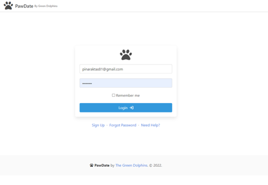
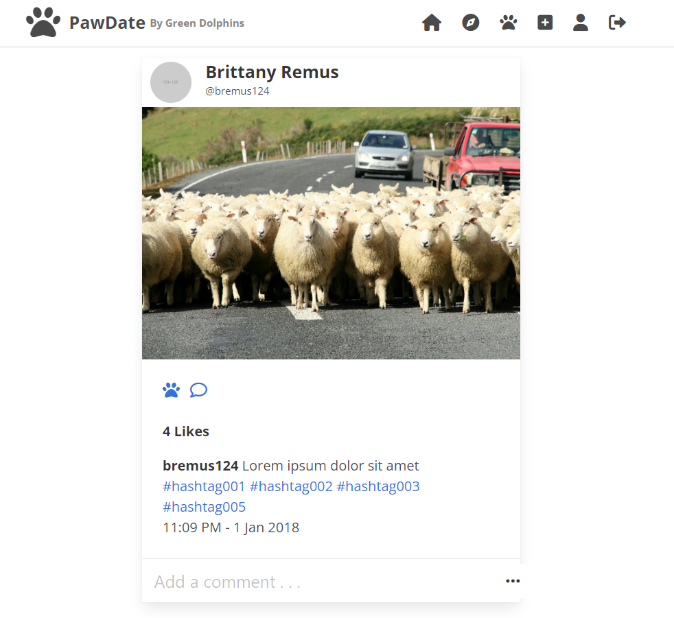

# green-dolphins-project

## Table of contents

- [General info](#general-info)
- [Technologies](#technologies)
- [Getting Started](#getting-started)
- [Contact](#contact)






## General info

This is a simple social mediate dating app for dogs

## trello board

We used Trello as tracking tool for tracking our work flow. 
https://trello.com/b/2izPnVlk/our-board

## Technologies

Project is created with:
We used the following technologies to create the project:

- bcrypt: "^5.0.1",
- dotenv: "^16.0.2",
- express: "^4.18.1",
- express-handlebars: "^6.0.6",
- express-session: "^1.17.3",
- mysql2: "^2.3.3",
- sequelize: "^6.21.4"

<!-- GETTING STARTED -->

## Getting Started

Follow the instruitons below to set up the projet locally. This will allow you to 
get a copy of the repo locally on your computer.

### Prerequisites

This is an example of how to list things you need to use the software and how to install them.

- npm
  ```sh
  npm install npm@latest -g
  ```

## Initializing database

This section is guide to install your database in your local machine.

```sh

mysql
source db/schema.sql;
// exit mysql

npm run seed

```

### Installation

_Below is an example of how you can instruct your audience on installing and setting up your app. This template doesn't rely on any external dependencies or services._

1. Get a free API Key at [https://example.com](https://example.com)
2. Clone the repo
   ```sh
   git clone https://github.com/your_username_/Project-Name.git
   ```
3. Install NPM packages
   ```sh
   npm install
   ```
4. Enter your API in `config.js`
   ```js
   const API_KEY = "ENTER YOUR API";
   ```

<p align="right">(<a href="#general-info">back to top</a>)</p>

<!-- CONTACT -->

## Contact

- [@bremus124](https://github.com/bremus124) - bremus124@gmail.com
- [@PinarAktas](https://github.com/PinarAktas) - pinaraktas81@gmail.com
- [@Ajalloh1](https://github.com/Ajalloh1) - mys4jalloh@gmail.com
- [@Summerjay0401](https://github.com/Summerjay0401) - summerjadefrosal@example.com

Project Link: [https://github.com/Summerjay0401/green-dolphins-project](https://github.com/Summerjay0401/green-dolphins-project)
Heroku Link : https://agile-reef-42699.herokuapp.com

<p align="right">(<a href="#general-info">back to top</a>)</p>

## Deploying to Heroku

```sh
heroku run node ./seeds/index.js -a agile-reef-42699
```
